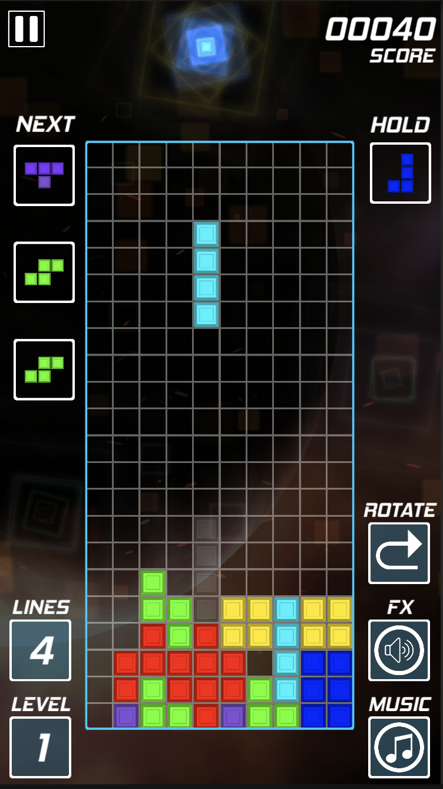
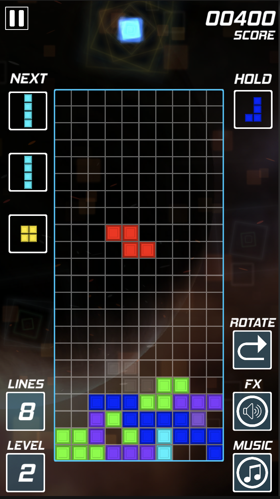

# Tetris - the Classic Tile Based Puzzle Game #

This is a clone of the original game [Tetris](https://en.wikipedia.org/wiki/Tetris) with some slight variations. It is a never ending game under which the player has to complete lines by arranging the falling tile pieces (tetrominoes) by moving and rotating them. The completed lines disappear and give points to the player and if the tiles stack up to the top of the board, the game ends. As the player scores more by clearing more lines, the level increases causing an increase in the speed at which the pieces are falling.

## Some of the additional gameplay enhancements ##

__Sound__: Background music, sound effects, vocal effects, clear row sound      
__Gameplay Features__: Rotation direction toggle button, Pause button   
__UI Enhancements__: Ghost shape, Shape queue, Shape holder     
__Particle effects__: Row glow effect, Land shape effect, Dynamic background        

| |  |
|-|-|

## Technologies used ##

Unity (version 2021.3.8f1)  
C#

## Instructions to Run ##

__To work on the project__  
After cloning the repository, open the project in Unity.  
Load the `Game` scene available under `Assets/Scenes/Game`. 

__To play the game__
Additionally, this game is also available on [Itch](https://chandak.itch.io/tetris) to play online (WebGL) or to download for MacOS and Windows.

